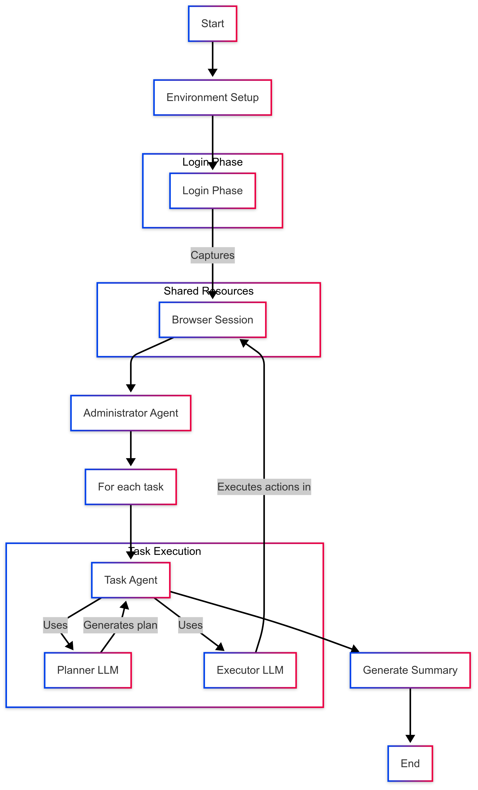

# Improving VLM Instruct Models to Perform Actions on New Environments


---

<div align="center">
  
</div>

---

## 🌟 Project Overview

Cloud‑console GUIs (AWS, GCP, Azure …) entangle deeply‑nested menus, dynamic DOM trees and stringent MFA checks—nightmares for today’s vision–language agents.
This repository delivers the **first open corpus** that couples **10 061 real Google Cloud screenshots with exact click/keystroke labels**, plus a reproducible pipeline that fine‑tunes state‑of‑the‑art Vision‑Language Models (VLMs) into **autonomous cloud‑admin assistants**.

Key take‑aways ⬇️

| ⭐ Contribution                                                               | Why it matters                                                        |
| ---------------------------------------------------------------------------- | --------------------------------------------------------------------- |
| **Dataset:** 10 k multimodal triples across 236 GCP admin workflows          | Fills the gap of step‑level supervision for complex GUIs              |
| **Persistent session hack** (human‑in‑the‑loop login → fully automated runs) | Circumvents MFA/device‑fingerprint hurdles                            |
| **Prompt‑efficiency study**                                                  | 83 % of tasks completed in ≤ 20 planner/executor prompts              |
| **Extensible pipeline**                                                      | Built on *browser‑use* + LangChain → drop‑in ready for other consoles |


### 🛠️ Methodology

Our **three‑stage pipeline** bridges high‑level intent to pixel‑perfect GUI control:

1. **Workflow synthesis (✓ 200 + tasks)** — enumerated common Google Cloud admin activities (e.g., creating buckets, setting IAM roles) and rewrote each as concise, natural‑language subtasks.
2. **Automated execution & logging** — enhanced the open‑source *browser‑use* agent for persistent sessions; each subtask is executed in Chrome while recording a 1920 × 1080 screenshot, the instruction seen by the LLM, and the exact DOM action taken.
3. **Dataset aggregation** — merged raw traces into **10 061** screenshot‑instruction‑action triples (the first corpus for cloud consoles), ready for SFT and future reinforcement fine‑tuning.

### 📊 Experimental Results

| Metric                           | Score    |
| -------------------------------- | -------- |
| **Workflows executed**           | 236      |
| **Tasks completed ≤ 20 prompts** | **83 %** |
| Median planner prompts           | 9        |
| Median executor prompts          | 10       |

> Scroll‑heavy pages and dynamic pop‑ups explain the bulk of remaining errors; adaptive scrolling heuristics are priority for the next iteration.

### 🚀 Key Technologies

* **LLMs** — Planner: `gemini‑2.5‑pro‑preview‑03‑25`; Executor: `gemini‑2.5‑flash‑preview‑04‑17` via LangChain.
* **Automation** — Patched *browser‑use* for human‑in‑the‑loop MFA, persistent cookies, and robust screenshot logging.
* **Analytics** — Prompt distributions and success metrics generated with Jupyter notebooks in `notebooks/`.

---


## 🚀 Quick Start

1. **Clone this repository**
2. **Install dependencies** in a virtual environment with `pip install -r requirements.txt`
3. **Add your credentials** (GCP service‑account JSON, optional OpenAI key)
4. **Run the agent** via `python gcp_administrator_agent.py`

---

## 🗄️ Dataset Format

Each JSONL row:

```jsonc
{
  "image_path": "runs/task_12/screenshots/step_3_20250426-142155.png",
  "instruction": "Click **Create bucket**",
  "action": {
    "click_element": { "index": 5 }
  }
}
```

* **Screenshots** are 1920 × 1080 PNGs.
* **Actions** follow the *browser‑use* schema (click, type, scroll, etc.).

> 📊 *Prompt‑count histograms & more stats are reproduced in `notebooks/analysis.ipynb`.*

---

## 🏗️ System Architecture

```
┌──────────────┐      plans      ┌──────────────┐      low‑lvl      ┌─────────────┐
│  Planner LLM │ ─────────────► │ Executor LLM │ ────────────────► │ Browser‑Use │
└──────────────┘   feedback ▲   └──────────────┘   screenshots     └─────────────┘
       ▲ log cbk │                              │ log cbk  ▼
       └─────────┴──────── state + DOM + images ┴─────────┘
```

* **Planner** decomposes the user goal → ordered sub‑goals.
* **Executor** generates concrete GUI commands.
* **Browser‑use** executes actions inside a real Chrome, capturing every frame.

See `docs/architecture.md` for an annotated diagram.

---

## ❗ Limitations & Roadmap

* Scroll‑heavy pages still brittle — adaptive viewport heuristics underway.
* Corpus currently GCP‑only — AWS & Azure capture scheduled Summer ’25.
* Reinforcement fine‑tuning to cut prompt count by ≥ 30 %.
* Console UIs evolve weekly — CI job will auto‑refresh dataset & tests.

---
